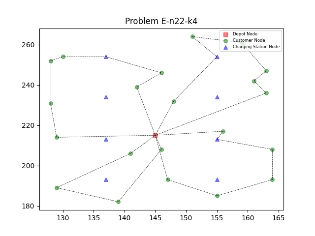
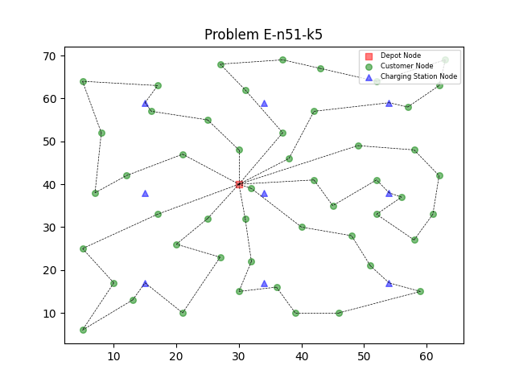

# Electric Vehicle Routing Problem #

The Electric Vehicle Routing Problem (EVRP) is a twist on the classic Vehicle Routing Problem (VRP) that considers the limitations of electric vehicles (EVs) for logistics and delivery planning.

Here's a breakdown of the key points:

Traditional VRP: This aims to find the most efficient routes for a fleet of vehicles to deliver goods or services, considering factors like distance, capacity, and customer locations.

EVRP Challenges:  Unlike traditional vehicles, EVs have limited driving range due to battery capacity and require recharging.  EVRP incorporates these challenges by:

Accounting for battery range: Routes need to be planned within the EV's driving range or include stops for recharging.
Factoring in charging stations: The location and availability of charging stations become important considerations when designing routes.
Potential for multiple routes: An EV might need to complete a delivery in multiple legs with charging stops in between.
EVRP Applications:  Delivery fleets, ride-sharing services, and public transportation with electric vehicles can all benefit from EVRP solutions to optimize their operations.  Optimizing routes reduces costs, improves efficiency, and minimizes environmental impact.

EVRP is an active area of research with various solution approaches being developed.  Some focus on minimizing travel distance or the number of vehicles needed, while others consider factors like charging time and energy consumption.

We applied the Greedy Search + Genetic Algorithm (GSGA) to solve the EVRP. The GSGA algorithm combines the Greedy Search heuristic with a Genetic Algorithm to find high-quality solutions efficiently.  The Greedy Search phase constructs initial solutions, which are then improved by the Genetic Algorithm through selection, crossover, and mutation operations.

*** Paper link [here](https://link.springer.com/article/10.1007/s10489-022-03555-8): A greedy search based evolutionary algorithm for electric vehicle routing problem ***

### This repository contains algorithms to solve the EVRP (Electric Vehicle Routing Problem) in Python ###

<a name="algorithms"></a>
#### Algorithms: ####
1. Greedy Search
2. Greedy Search + Genetic Algorithm (GSGA)

### Installation ###
```bash
pip install -e .
```

### How to run the code ###
```bash
python evrp.py -p ./benchmarks/evrp-2019/E-n22-k4.evrp -a GSGA -o ./results/GSGA/ -n 10 --seed 42
```

*** Example of solution in graph E-n22-k4.evrp using GSGA algorithm

*** Example of solution in graph E-n51-k5.evrp using GSGA algorithm



The algorithm in C++ version [here](https://github.com/NeiH4207/EVRP) archived top 3 in competition [CEC-12 (2019)](https://mavrovouniotis.github.io/EVRPcompetition2020/)

|     instances    | VNS |           |           |        | SA |           |           |        | GSGA |           |           |         |
|:----------------:|:-----------:|:---------:|:---------:|:------:|:----------:|:---------:|:---------:|:------:|:-------------:|:---------:|:---------:|:-------:|
|                  |     min     |    max    |    mean   |  stdev |     min    |    max    |    mean   |  stdev |      min      |    max    |    mean   |  stdev  |
|   E-n22-k4  | 384.67      | 384.67    | 384.67    | 0.0    | 384.67     | 384.67    | 384.67    | 0.00   | 384.67        | 384.67    | 384.67    | 0.0     |
|   E-n23-k3  | 571.94      | 571.94    | 571.94    | 0.0    | 571.94     | 571.94    | 571.94    | 0.00   | 571.94        | 571.94    | 571.94    | 0.0     |
|   E-n30-k3  | 509.47      | 509.47    | 509.47    | 0.0    | 509.47     | 509.47    | 509.47    | 0.00   | 509.47        | 509.47    | 509.47    | 0.0     |
|   E-n33-k4  | 840.14      | 840.46    | 840.43    | 1.18   | 840.57     | 873.33    | 854.07    | 12.80  | 844.25        | 846.21    | 845.62    | 0.92    |
|   E-n51-k5  | 529.90      | 548.98    | 543.26    | 3.52   | 533.66     | 533.66    | 533.66    | 0.00   | 529.90        | 553.23    | 542.08    | 8.57    |
|   E-n76-k7  | 692.64      | 707.49    | 697.89    | 3.09   | 701.03     | 716.77    | 712.17    | 5.78   | 697.27        | 730.92    | 717.30    | 9.58    |
|  E-n101-k8  | 839.29      | 853.34    | 853.34    | 4.73   | 845.84     | 856.74    | 852.48    | 3.44   | 852.69        | 887.14    | 872.69    | 9.58    |
|  X-n143-k7  | 16028.05    | 16883.38  | 16459.31  | 242.59 | 16610.37   | 17396.06  | 17188.90  | 170.44 | 16488.60      | 17478.86  | 16911.50  | 282.30  |
|  X-n214-k11 | 11323.56    | 11660.70  | 11482.20  | 76.14  | 11404.44   | 11881.73  | 11680.35  | 116.47 | 11762.07      | 12309.38  | 12007.06  | 156.69  |
|  X-n352-k40 | 27064.88    | 27418.38  | 27217.77  | 86.20  | 27222.96   | 27796.69  | 27498.03  | 155.62 | 28008.09      | 28792.66  | 28336.07  | 205.29  |
|  X-n459-k26 | 25370.80    | 25774.62  | 25582.27  | 106.89 | 25464.84   | 26038.65  | 25809.47  | 157.97 | 26048.21      | 26742.11  | 26345.12  | 185.14  |
|  X-n573-k30 | 52181.51    | 51929.24  | 52548.09  | 278.85 | 51929.24   | 53534.01  | 52793.66  | 577.24 | 54189.62      | 56327.62  | 55327.62  | 548.05  |
|  X-n685-k75 | 71345.40    | 72187.75  | 71770.57  | 197.08 | 72549.90   | 73693.49  | 73124.98  | 320.07 | 73925.56      | 75535.99  | 74508.03  | 409.43  |
|  X-n749-k98 | 81002.01    | 81634.06  | 81327.39  | 176.19 | 81392.78   | 82414.80  | 81848.13  | 275.26 | 84034.73      | 85549.36  | 84759.79  | 376.10  |
| X-n819-k171 | 164289.95   | 165571.48 | 164926.41 | 318.62 | 165069.77  | 166640.37 | 165895.78 | 403.70 | 170965.68     | 173371.76 | 172410.12 | 568.58  |
| X-n916-k207 | 341649.91   | 343338.01 | 342460.70 | 510.66 | 342796.88  | 344521.64 | 343533.85 | 556.98 | 357391.57     | 362422.52 | 360269.94 | 1192.57 |
| X-n1001-k43 | 77476.36    | 78464.68  | 77920.52  | 234.73 | 78053.86   | 79226.81  | 78593.50  | 306.27 | 78832.90      | 79567.00  | 79163.34  | 229.19  |

